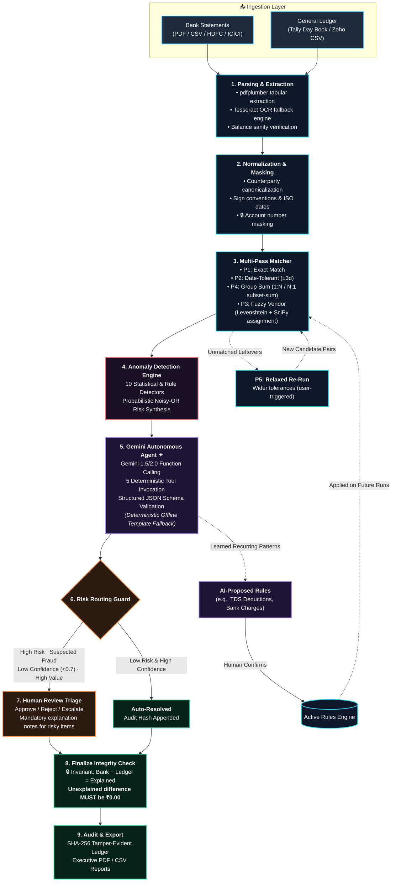

<p align="center">
  
</p>

<p align="center">
  <b>Autonomous Bank Reconciliation & Financial Anomaly Investigation Agent</b><br/>
  <i>Engineered for accounting precision, powered by Google Gemini, governed by deterministic rules.</i>
</p>

<p align="center">
  <a href="https://github.com/blank-0007/CodeFiesta-GIT-hackathon/actions"></a>
  <a href="https://github.com/blank-0007/CodeFiesta-GIT-hackathon/actions"></a>
  <a href="https://fastapi.tiangolo.com"></a>
  <a href="https://react.dev"></a>
  <a href="https://ai.google.dev"></a>
  <a href="https://tailwindcss.com"></a>
  <a href="#strict-financial-integrity"></a>
</p>

<p align="center">
  <a href="#-quick-start">🚀 Quick Start</a> •
  <a href="#-architecture">🏗️ Architecture</a> •
  <a href="#-matching-engine-passes">⚡ Multi-Pass Engine</a> •
  <a href="#-10-anomaly-detectors">🛡️ Detectors</a> •
  <a href="#-gemini-investigation-agent">✦ AI Agent</a> •
  <a href="#-3-minute-demo-walkthrough">🎬 Demo Script</a> •
  <a href="#-api-reference">📡 API Spec</a>
</p>

---

## 💡 The Problem & The ReconAI Paradigm

Accountants spend **8–15 hours every month** manually reconciling bank statements against general ledgers (Tally, Zoho Books, SAP). The pain is not just finding matching line items—it is manually chasing down the leftovers: *timing lags, bank fee deductions, split vendor disbursements, unrecorded transfers, or potential rogue transactions.*

ReconAI solves this through a **3-tier hybrid intelligence architecture**:

```
┌─────────────────────────────────────────────────────────────────────────────┐
│ 1. ⚡ DETERMINISTIC RULES FIRST (Cheapest & 100% Reproducible)              │
│    Exact (P1), Date-Tolerant (P2), Fuzzy Vendor (P3) & Group-Sum (P4)       │
│    matches clear 95%+ of normal transaction volume in milliseconds.         │
├─────────────────────────────────────────────────────────────────────────────┤
│ 2. ✦ GEMINI INVESTIGATION AGENT (Contextual & Grounded)                     │
│    Unmatched & suspicious items trigger an autonomous Gemini agent with     │
│    5 deterministic search tools. Explains WHY with real evidence.           │
├─────────────────────────────────────────────────────────────────────────────┤
│ 3. 👤 HUMAN-IN-THE-LOOP AUTHORIZATION (Zero Auto-Approval for Risk)          │
│    Fraud alerts, approval threshold violations, and low-confidence items    │
│    route to human triage. Financial lock requires ₹0.00 unexplained.        │
└─────────────────────────────────────────────────────────────────────────────┘
```

> [!IMPORTANT]
> **Deterministic code decides what is true. The AI explains why. Humans decide anything risky.**  
> In the UI, every AI recommendation displays its confidence rating, model identifier, and clickable transaction evidence, highlighted with a signature **`violet ✦ AI`** badge.

---

## 🏗️ System Architecture



---

## ⚡ Core Engine Deep Dives

<details open>
<summary><b>1. ⚡ Multi-Pass Deterministic Matching Engine (P1 to P5)</b></summary>
<br/>

The matcher executes sequentially. Candidates matched in earlier passes are extracted from the pool so downstream passes operate only on unresolved items.

| Pass | Identifier | Date Window | Amount Tolerance | Counterparty Logic | Computational Technique |
| :--- | :--- | :---: | :---: | :--- | :--- |
| **P1** | `P1 · Exact` | `0 days` | `₹0.00` | Exact cleaned vendor or reference string | Hash indexing (`(date, amount, ref)`) |
| **P2** | `P2 · Date ±3d` | `±3 days` | `₹0.00` | Same normalized vendor | Bisection index search (`bisect_left`) |
| **P3** | `P3 · Fuzzy vendor` | `±3 days` | `₹0.00` | Token set ratio & Levenshtein similarity $\ge 0.82$ | Bipartite matching via SciPy `linear_sum_assignment` |
| **P4** | `P4 · Group sum` | `±5 days` | `₹0.00` | Same vendor, multiple invoices to single payout (1:N or N:1) | Bounded subset-sum search (max 25 entries) |
| **P5** | `P5 · Relaxed re-run` | `±7 days` | `₹5,000.00` | Vendor similarity $\ge 0.70$ | Interactive user-initiated re-run with distinct audit tags |

</details>

<br/>

<details open>
<summary><b>2. 🛡️ 10 Anomaly Detectors & Noisy-OR Probabilistic Scoring</b></summary>
<br/>

Rather than naive linear weighting, ReconAI integrates multiple independent statistical anomalies into a single calibrated **Risk Score $[0, 1]$** using the **Noisy-OR model**:

$$\text{RiskScore} = 1 - \prod_{i=1}^{n} (1 - w_i \cdot s_i)$$

Where $s_i \in [0, 1]$ represents the raw anomaly detector strength and $w_i \in (0, 1]$ represents the calibrated risk weight.

| Detector ID | Target Anomaly | Trigger Condition | Weight ($w_i$) | Risk Class |
| :--- | :--- | :--- | :---: | :---: |
| `approval_limit` | Smurfing / Split Authorizations | Transaction amount within 3% beneath internal approval cutoff (e.g. ₹49,900 vs ₹50,000) | `0.85` | 🔴 **CRITICAL** |
| `duplicate_detector` | Accidental Double Invoicing | Identical amount & vendor within a ±7 day window | `0.90` | 🔴 **CRITICAL** |
| `new_vendor` | First-time Counterparty | Counterparty never observed in historical general ledger records | `0.65` | 🟠 **WARNING** |
| `weekend_payment` | Unusual Timing | High disbursement executed on Saturday or Sunday without scheduled mandate | `0.55` | 🟠 **WARNING** |
| `high_value` | Large Outlier Exposure | Exceeds company high-value threshold (e.g. > ₹1,00,000) | `0.70` | 🟠 **WARNING** |
| `period_boundary` | Cutoff Timing Discrepancy | Payout booked in final 48h of month appearing in subsequent bank cycle | `0.50` | 🟡 **TIMING** |
| `amount_outlier` | Statistical Deviation | $> 3.0\times$ Median Absolute Deviation (MAD) for vendor | `0.75` | 🔴 **CRITICAL** |
| `amount_mismatch` | Minor Pricing/TDS Variances | Near-match candidate with small delta (e.g., TDS 2% or bank fees) | `0.60` | 🟡 **TIMING** |
| `no_counterpart` | Phantom / Unrecorded Entry | Transaction missing completely from counter-ledger | `0.80` | 🔴 **CRITICAL** |
| `round_amount` | Artificial / Manual Entries | Unusually large round sums (multiples of ₹10,000) for consulting/services | `0.40` | 🔵 **INFO** |

</details>

<br/>

<details>
<summary><b>3. ✦ Autonomous Gemini Investigation Agent & Grounded Tools</b></summary>
<br/>

When an item is flagged, ReconAI invokes an autonomous Google Gemini agent with strict **function calling**. The model is prohibited from "guessing" numbers; it can only formulate hypotheses by querying 5 deterministic backend tools:

```
                  ┌──────────────────────────────────────────────┐
                  │          Gemini 1.5 / 2.0 Agent ✦            │
                  │   Structured Output Schema: Category, Action │
                  │   Confidence [0-1], Cites Evidence Txn IDs   │
                  └──────────────────────┬───────────────────────┘
                                         │ Calls deterministic tools
        ┌───────────────────┬────────────┴────────┬───────────────────┐
        ▼                   ▼                     ▼                   ▼
  search_ledger()   find_duplicates()   get_vendor_history()   check_period_boundary()
  Fuzzy counterpart  ±7d duplicate txns  Past median & count    Detect month cutoff lags
```

- **Tool 1: `search_ledger`** — Locates candidates on the opposing ledger by fuzzy counterparty name, amount, and date window.
- **Tool 2: `find_duplicates`** — Queries matching amounts and counterparties across the period.
- **Tool 3: `get_vendor_history`** — Retrieves historical disbursements, median values, first-seen timestamps, and last 5 transactions.
- **Tool 4: `check_period_boundary`** — Scans transactions recorded in the first days of the following billing cycle.
- **Tool 5: `get_balance_context`** — Pulls opening balances and day-end running balances for the affected bank account.
- **Privacy & Redaction:** Bank account numbers and PII are masked before prompts are dispatched.
- **Zero-Downtime Offline Fallback:** If `GEMINI_API_KEY` is omitted or API quotas are exhausted, ReconAI automatically engages a deterministic templated investigation engine with bounded confidence ($0.60$).

</details>

<br/>

<details>
<summary><b>4. 🔒 Strict Financial Integrity & Cryptographic Audit Trail</b></summary>
<br/>

### Conservation of Value Invariant
Every reconciliation run is governed by an unshakeable mathematical proof:

$$\Delta_{\text{Total}} = \left| \sum \text{Bank Transactions} - \sum \text{Ledger Transactions} \right| = \text{Explained} + \text{Unexplained}$$

```
┌─────────────────────────────────────────────────────────────────────────────┐
│ 🔴 Unexplained Difference > ₹0.00  ──►  [HTTP 409] Finalize Refused        │
│ 🟢 Unexplained Difference = ₹0.00  ──►  Run Finalized & Cryptographically Locked │
└─────────────────────────────────────────────────────────────────────────────┘
```

### Append-Only SHA-256 Hash Chain
Every user decision, automated match, rule change, and AI investigation is written to an immutable audit ledger where entry $i$ encapsulates the cryptographic hash of entry $i-1$:

$$\text{Hash}_i = \text{SHA-256}\left(\text{Hash}_{i-1} \parallel \text{Timestamp} \parallel \text{Actor} \parallel \text{Action} \parallel \text{Payload}\right)$$

Any unauthorized alteration to historical database records immediately breaks the chain validation.

</details>

<br/>

<details>
<summary><b>5. 🎨 Design System & Color-Coded Semantic Tokens</b></summary>
<br/>

ReconAI features a high-density, dark-first financial cockpit styled with Tailwind CSS, Radix primitives, and custom semantic tokens defined in `src/styles/globals.css`:

| Token | Dark Hex | Role | Visual Indicator |
| :--- | :--- | :--- | :--- |
| `--sys` | `#22D3EE` (Cyan) | System Match / Deterministic Execution |  `P1–P4 Match` |
| `--attn` | `#FB923C` (Orange) | Unmatched Item requiring human review |  `Attention` |
| `--crit` | `#F87171` (Red) | High Risk, Approval Threshold Violation, Fraud |  `Critical Anomaly` |
| `--warn` | `#FBBF24` (Amber) | Timing discrepancy, weekend run, small delta |  `Warning` |
| `--ai` | `#A78BFA` (Violet) | AI Agent Investigation & Suggestion |  `✦ AI Claim` |
| `--ok` | `#34D399` (Emerald) | Approved, Balanced, Zero Unexplained |  `Finalized` |

**Financial Typography:**
- Monospace font (`JetBrains Mono`) for all financial figures and transaction IDs.
- Dual formatting support: Indian Lakh/Crore grouping (`₹1,24,500.00`) and International standard.
- Signed representations: Debits prefixed with `−` in red; credits in green.

</details>

<br/>

<details>
<summary><b>6. ⌨️ Power-User Keyboard Shortcuts</b></summary>
<br/>

Designed for rapid accounting triage without reaching for the mouse:

| Key Binding | Functionality | Context |
| :---: | :--- | :--- |
| <kbd>⌘</kbd> + <kbd>K</kbd> / <kbd>Ctrl</kbd> + <kbd>K</kbd> | Global Command Palette & Transaction Search | Application-wide |
| <kbd>?</kbd> | Toggle Keyboard Shortcuts Modal | Application-wide |
| <kbd>M</kbd> | Pair Selected Bank & Ledger items into a Manual Match | Matched / Unmatched View |
| <kbd>A</kbd> | Approve Selected Finding | Review Queue (Focus Mode) |
| <kbd>R</kbd> | Reject Finding Recommendation | Review Queue (Focus Mode) |
| <kbd>E</kbd> | Escalate Finding to Senior Auditor | Review Queue (Focus Mode) |
| <kbd>J</kbd> / <kbd>K</kbd> | Navigate Down / Up through Review Items | Review Queue |

</details>

---

## 🚀 Quick Start

Choose the method that best matches your environment:

### Option A: Docker Compose (Recommended)
Launch the entire system (FastAPI backend + Vite frontend + SQLite database seeded with September 2026 reconciliation data) with a single command:

```bash
# 1. Clone the repository
git clone https://github.com/blank-0007/CodeFiesta-GIT-hackathon.git
cd CodeFiesta-GIT-hackathon

# 2. Configure environment (optional: supply Gemini API key)
cp backend/.env.example backend/.env

# 3. Spin up the containers
docker compose up --build
```

- 🌐 **Web Dashboard:** [http://localhost:5173](http://localhost:5173)
- 🔌 **API Documentation & Health:** [http://localhost:8000/docs](http://localhost:8000/docs) (Health: `/api/health`)
- 🔄 **Reset Database:** Run `docker compose down -v` to reset data volumes.

---

### Option B: Local Full-Stack Development

#### 1. Backend Service (Python 3.12 + [uv](https://docs.astral.sh/uv/))

```bash
cd backend

# Create virtual environment and install dependencies
uv venv --python 3.12
source .venv/bin/activate    # On Windows: .venv\Scripts\activate
uv pip install -e ".[dev]"

# Configure environment
cp .env.example .env

# Populate demo reconciliation runs (April – September 2026)
python -m scripts.seed_demo

# Launch the FastAPI dev server
uvicorn app.main:app --reload --port 8000
```
*(Note: OCR capabilities require Tesseract: `brew install tesseract` on macOS or `sudo apt install tesseract-ocr` on Ubuntu).*

#### 2. Frontend Application (Node 18+)

```bash
# In the repository root:
npm ci

# Launch Vite dev server linked to local backend
VITE_API_BASE_URL=http://localhost:8000 VITE_USE_MOCKS=false npm run dev
```
Open [http://localhost:5173](http://localhost:5173).

---

### Option C: Instant Mock Mode (Zero Backend Required)

Want to explore the frontend UI immediately without installing Python or Docker?

```bash
npm ci
VITE_USE_MOCKS=true npm run dev
```

The browser will initiate an in-memory **MSW (Mock Service Worker)** API with 12 months of pre-seeded financial data, live simulated SSE progress, realistic network latency, and interactive role switching.

---

## 🎬 3-Minute Demo Walkthrough

Follow this script to experience the full capabilities of ReconAI during evaluations:

```
Step 1: Dashboard
  └─ Review KPI cards, 12-month auto-match trends, anomaly category donuts, and "Needs Attention" queue.

Step 2: Inspect Active Run (September 2026)
  └─ View summary strip showing the Conservation of Value equation.
  └─ Notice the Unexplained metric remains RED until anomalies are cleared.

Step 3: Test the Live Pipeline (SSE Streaming)
  └─ Navigate to Runs → "New reconciliation" → Click "Use sample files".
  └─ Uploads HDFC Bank PDF, ICICI Bank CSV, and Tally Day Book ledger.
  └─ Pass through column mappings → Click "Start Run".
  └─ Watch real-time SSE stage progression: Ingest ➔ Normalize ➔ Match ➔ Detect ➔ AI Investigate.

Step 4: Interactive Matching & Manual Drag-and-Drop
  └─ Inspect Pass Badges: P1 (Exact), P2 (Date ±3d), P3 (Fuzzy), P4 (Group Sum).
  └─ Drag an unmatched bank row onto an unmatched ledger row (or select both and press 'M').

Step 5: Inspect Suspected Fraud Anomaly
  └─ Click the ₹49,900 anomaly (paid to a 3-day-old vendor just beneath the ₹50,000 threshold).
  └─ Review the Noisy-OR breakdown of signals (approval_limit + new_vendor).
  └─ Expand the Gemini Agent Trace: inspect the 5 deterministic tool calls and citations.

Step 6: P5 Relaxed Tolerance Re-Run
  └─ Click "Re-run with relaxed tolerances (₹5,000)".
  └─ The engine re-matches near-candidate items, tagging them as "P5 · Relaxed re-run".

Step 7: Review Queue Triage (Focus Mode)
  └─ Enter Focus Mode (Keyboard navigation: J / K).
  └─ Bulk approve low-risk timing differences.
  └─ Fraud and high-value items require mandatory justification notes before approval.

Step 8: AI Rule Proposal & Dry-Run Testing
  └─ Go to Rules tab. Review an AI-proposed recurring rule ("2% TDS deduction on Vendor X").
  └─ Use the "Test Rule" impact preview to calculate retrospective match gain before activating.

Step 9: Finalize Run (Zero-Difference Invariant)
  └─ Once all items are resolved, Unexplained reaches exactly ₹0.00.
  └─ Click "Finalize Run" to generate the immutable cryptographic lock.

Step 10: Export & Audit Trail
  └─ Download executive anomaly reports in PDF/CSV with shareable link.
  └─ View the append-only SHA-256 audit log documenting every human and AI decision.
```

---

## 📡 REST API & SSE Wire Specification

All endpoints share canonical TypeScript definitions located in [`src/api/types.ts`](src/api/types.ts).

### Endpoint Directory

| Method | Route Path | Description | Access Tier |
| :---: | :--- | :--- | :--- |
| `GET` | `/api/health` | Service liveness and database ping | Public |
| `POST` | `/api/uploads` | Multipart file upload (PDF/CSV) with instant header sanity check | Accountant / Admin |
| `GET` | `/api/runs` | List historical reconciliation runs | All Roles |
| `POST` | `/api/runs` | Trigger a new reconciliation run across uploaded files | Accountant / Admin |
| `GET` | `/api/runs/:id` | Fetch run metadata, match statistics, and stage status | All Roles |
| `GET` | `/api/runs/:id/events` | **Server-Sent Events (SSE)** live pipeline stream (`log`, `stages`, `done`) | All Roles |
| `GET` | `/api/runs/:id/matches` | Retrieve matched pairs with pass classifications (P1–P5) | All Roles |
| `GET` | `/api/runs/:id/unmatched` | Retrieve remaining unmatched bank and ledger items | All Roles |
| `GET` | `/api/runs/:id/findings` | Fetch anomalies, risk scores, and AI investigations | All Roles |
| `POST` | `/api/runs/:id/rerun` | Execute P5 relaxed-tolerance matching pass on leftovers | Accountant / Admin |
| `POST` | `/api/runs/:id/finalize` | Finalize run (Enforces strict ₹0.00 unexplained check) | Accountant / Admin |
| `GET` | `/api/findings/:id` | Detailed finding view with agent tool execution history | All Roles |
| `POST` | `/api/findings/:id/decision`| Submit human decision (`approve`, `reject`, `escalate`) | Reviewer / Admin |
| `POST` | `/api/matches/manual` | Create manual match link between bank and ledger records | Accountant / Admin |
| `POST` | `/api/matches/:id/unmatch`| Break an existing match link with mandatory reason code | Accountant / Admin |
| `GET` | `/api/rules` | List active rules, AI-proposed rules, and detector configs | All Roles |
| `POST` | `/api/rules/:id/decision`| Approve, customize, or reject an AI-proposed rule | Admin |
| `POST` | `/api/detectors/:id/test` | Dry-run detector threshold modification on historical run | Admin |
| `GET` | `/api/reports/:id/download` | Export official reconciliation report (CSV text or ReportLab PDF) | All Roles |
| `GET` | `/api/audit` | Query append-only SHA-256 hash-chained audit records | Auditor / Admin |

### Wire-Format Standards
- **Strict Decimal Precision:** Money is never formatted as floating point numbers. Always represented as signed decimal strings with 2 decimal places (`"-49900.00"`).
- **CamelCase JSON:** All request and response bodies use camelCase keys.
- **SSE Stream Protocol:** Live run execution emits `event: log`, `event: stages`, and `event: done` with auto-reconnect fallback.

---

## 👥 Role-Based Access Control (RBAC)

ReconAI enforces enterprise-grade separation of duties across 4 distinct roles:

| Privilege / Capability | 👑 Admin | 💼 Accountant | 🔍 Reviewer | 📜 Auditor |
| :--- | :---: | :---: | :---: | :---: |
| Upload Bank Statements & Day Books | ✅ | ✅ | ❌ | ❌ |
| Trigger New Reconciliation Pipeline | ✅ | ✅ | ❌ | ❌ |
| Manual Match & Unmatch Transactions | ✅ | ✅ | ❌ | ❌ |
| Approve / Reject Low-Risk Findings | ✅ | ✅ | ✅ | ❌ |
| Authorize Fraud / High-Value Findings | ✅ | ❌ | ✅ | ❌ |
| Finalize Reconciliation Run | ✅ | ✅ | ❌ | ❌ |
| Approve AI-Proposed Rules & Edit Detectors | ✅ | ❌ | ❌ | ❌ |
| Access Full Cryptographic Audit Log | ✅ | ❌ | ❌ | ✅ |

> [!TIP]
> In development mode (`AUTH_MODE=demo`), you can instantly toggle between roles via the **User Profile Menu → Dev Mode Switcher** in the top right corner. For production setups, switch to `AUTH_MODE=jwt` with HS256 signed bearer tokens.

---

## 🧪 Comprehensive Test Suite

ReconAI is verified by a test matrix covering API contracts, financial math, detector scoring, and end-to-end flows:

```bash
# 1. Run Backend Unit & API Contract Tests (332 Tests)
cd backend
pytest -v

# 2. Run Frontend Unit & Permission Matrix Tests (94 Tests)
npm test

# 3. TypeScript Type Safety Check
npm run typecheck

# 4. Playwright End-to-End Smoke Test
npm run e2e:install    # First-time: downloads browser
npm run e2e            # Exercises full flow: upload → match → investigate → finalize
```

### Verification Matrix
- 🛡️ **332 Backend Tests:** Verifies decimal money arithmetic, SciPy linear sum assignment, 10 detector thresholds, noisy-OR formulas, SSE streaming frames, role permission gates, and report generation.
- ⚡ **94 Frontend Vitest Tests:** Verifies Indian currency formatting (`₹1,24,500.00`), optimistic UI updates, keyboard navigation, role-gated UI elements, and MSW mocks.
- 🔒 **Zero-Difference Contract:** Validated across all test fixtures. Finalization is refused whenever unexplained difference is non-zero.

---

## 📁 Repository Structure

```
.
├── docs/                        # Architectural assets & vector SVG banner
│   └── banner.svg
├── backend/                     # High-performance FastAPI backend
│   ├── app/
│   │   ├── agent/               # Gemini client, deterministic tools, offline fallbacks
│   │   ├── api/routers/         # FastAPI endpoints (runs, matches, findings, audit, rules)
│   │   ├── core/                # Config, JWT/Demo auth, money (Decimal), errors
│   │   ├── db/                  # SQLAlchemy models, sessions, migrations
│   │   ├── detect/              # 10 Statistical/rule detectors + Noisy-OR combination
│   │   ├── ingest/              # pdfplumber parsing, CSV ingestion, Tesseract OCR
│   │   ├── matching/            # Multi-pass matching engine (P1–P5) + SciPy assignment
│   │   ├── normalize/           # Vendor canonicalization, Levenshtein fuzzy matching
│   │   ├── reports/             # ReportLab PDF generation & CSV export
│   │   └── services/            # Pipeline orchestration, background workers, audit chain
│   ├── tests/                   # 332 pytest suites (matching, detectors, money, API contracts)
│   ├── scripts/seed_demo.py     # Seeds realistic 6-month financial datasets
│   └── pyproject.toml
├── src/                         # React 18 + Vite + TypeScript frontend
│   ├── api/                     # Canonical API contract (types.ts), client, MSW mocks
│   ├── components/              # Radix UI + Tailwind design system components
│   ├── features/                # Dashboard, Runs, Matches, Review Queue, Rules, Audit
│   ├── hooks/                   # Custom state hooks, keyboard shortcuts, SSE listeners
│   ├── lib/                     # Permission matrix, money formatting, big.js helpers
│   ├── styles/globals.css       # Semantic color tokens (--sys, --attn, --crit, --ai, --ok)
│   └── test/                    # Vitest component & permission test suites
├── e2e/                         # Playwright end-to-end smoke test
├── Dockerfile.frontend          # Nginx production build
├── docker-compose.yml           # Multi-container orchestration
└── package.json
```

---

## 📄 License & Hackathon Attribution

Crafted for **CodeFiesta GIT Hackathon** by **[@blank-0007](https://github.com/blank-0007)**.  
Licensed under the [MIT License](LICENSE).
